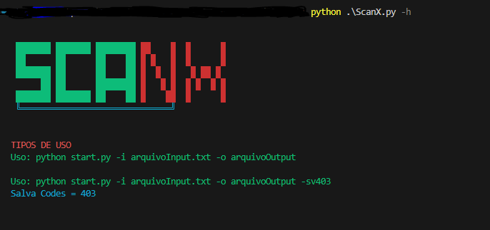
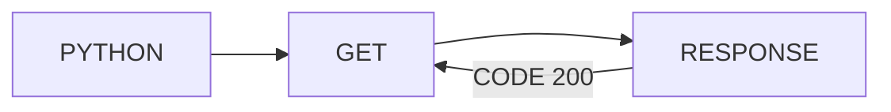

# ScanX - HTTP Status Code Checker

Script de Verificação de Códigos de Status HTTP



O ScanX é um script simples, porém eficiente, que tem como função verificar o código de status HTTP retornado por um site ou uma de suas rotas



## Como Utilizar

```powershell
    [x] - python ScanX.py -h                  
    [x] - python ScanX.py -i InputFile.txt -o OutputFile    
    [x] - python ScanX.py -i InputFile.txt -o OutputFile -sv 403    
    [x] - python ScanX.py -i InputFile.txt -v   
    [x] - python ScanX.py -i google.com -v   
```

## Parâmetros

* -i : Arquivo de entrada (.txt) ou URL.

* -o : Arquivo de saída (opcional).

* -sv : Salva apenas respostas com o código de status especificado.

* -v : Ativa o modo verbose para uma saída mais detalhada.


## Comportamento Padrão

Por padrão, o OutputFile conterá todas as localizações ou rotas que retornarem o status code 200 salvas em um arquivo .txt. Caso queira modificar o código de status para salvar, use a flag **-sv**.

---
Seja feliz!

